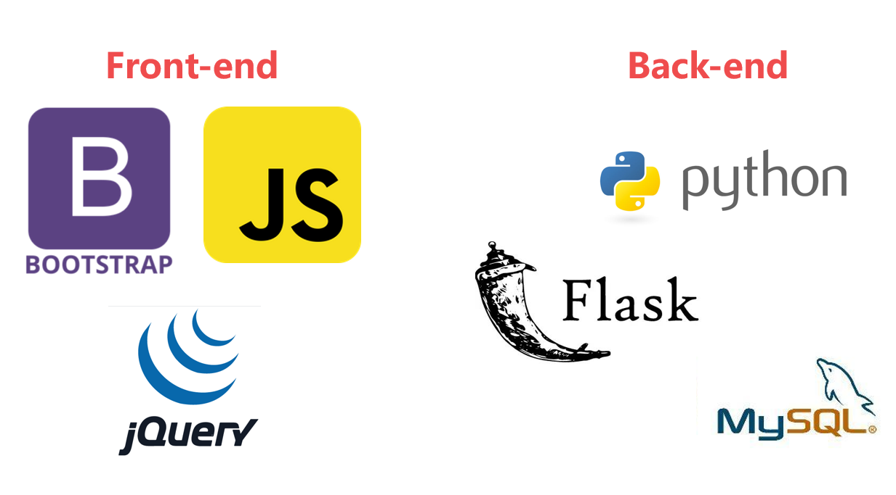
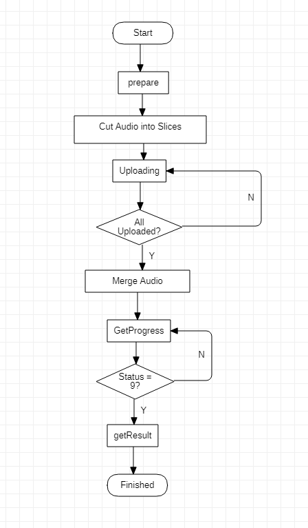

# Meeting Archiving System

## Architecture



## What's New

##### Previous version

1. Providing the login, signup and logout for the system.
2. providing the method for setting up the group.
3. providing the local recording for each group in the system.
4. providing the interface for each group to download the audio.

##### Current version

1. Fix the logic of the group
2. Adding the group search method for user
3. Adding the uploading files and downloading files for user
4. Adding transcription for mp4 files
5. Adding the online video play

## OS Platform Of Test and Development

Windows 10

## Demo Start

1. Make sure __Python3.6.5__ has been installed;

2. __PyCharm__ is recommended for this project;

3. Import the Project into __PyCharm __;

4. Install __MySQL server__, and python connector;

5. Remember your ***port number*** and ***password***;

6. Create a scheme called, remember the ___name___;

7. Add ___port number___, ___password__ and __database name__ in ```CONFIG.py```.**Database** object;

8. User ```init.py``` to build your new database by

   ```shell
   python init.py
   ```

9. You may also need to activate virtual environment;

10. Run the script to install relative packages;

```shell script
	pip install -r requirements.txt
```

9. Register and Apply XFYUN API, click [here](https://www.xfyun.cn/services/lfasr). Then you can get ```APPID``` and ```SecreteKey``` (secrete key) for the permission of ***XFYUN*** Web API. Add these two in ```CONFIG.py```. ___XFYUN___ object;

10. Run the program via __PyCharm__, or type the script in the terminal;


```shell script
	flask run
```

11. Finally, open http://127.0.0.1:5000/index.html in your browser.

## Directory of Project

You can find the directory information of the project in this part.

```
├── .idea									// The configuration of VScode
├── __pycache__                 			// The Configuration of Pycharm
├── static                      			// The web pages of the projects
|	├── css                     			// The CSS layout for specific pages
|	│   ├── bootstrap.min.css		
│	│   ├── group.css              
│	│   ├── index.css         		
│	│   ├── login.css              
│	│   ├── online_session.css      
│	│   └── personal.css  
│	├── img									// Contain the image sources
│   ├── bootstrap-5.0.2-dist
|	├── js                      			// The CSS layout for specific pages
|	│   ├── API.js							// Utils based on jquery.min.js
|	│   └── jquery.min.js           		// the JQuery Framework
|	├── uploads								// Uploading and downloading folder	
│   ├── group.html				
│   ├── index.html				
│   ├── login.html				
│   ├── meeting.html			
│   ├── player.html  			
│   ├── upload.html 		
│   └── personal.html
├── utilities                      			// The web pages of the projects
|	├── transcription               		// The CSS layout for specific pages
|	│   ├── generate_transcription.py		// Transcription generator       
│   |	└── weblfasr_python3_demo.py 		// Basic API By XFyun
|	├── db.py								// DataBase configuration
|	└── CONFIG.py							// Normal configuration of project
├── Readme.md                   			// Help and Infomation
├── app.py                      			// The back-end entrance of the system
├── init.py									// Project Initializer
├── requirements.txt						// the package and version
├── XFTranscription.png						// The workflow of Transcription
└── Technology.png							// current Technology we used in this project

```

## XF Transcription

The current speech transcription of this project is provided by XFyun. This API is based on a deep full-sequence convolutional neural network, which can convert long segments of audio(smaller than 5 hours) data into text data. 

This kind of transcription is for recorded audio(not real-time). After files have been uploaded successfully, waiting for a few seconds, the server can return a JSON file which contains the best result of transcription. If the transfer time is longer than usual, there is a high probability that there will be a transfer peak in the current time period. Please wait patiently.

In addition, to make the transfer service smoother, please try your best to transfer audio files of more than 5 minutes. Uploading a large number of short audio may cause strain on the network and server resources, resulting in a backlog of tasks.



The Efficiency of using XFyun to do Transcription:

| Audio Length (Minutes) | Time of Generating the result (Minutes) |
| :--------------------: | :-------------------------------------: |
|          X<10          |                   Y<3                   |
|        10<=X<30        |                 3<=Y<6                  |
|        30<=X<60        |                 6<=Y<10                 |
|         60<=X          |                10<=Y<20                 |


